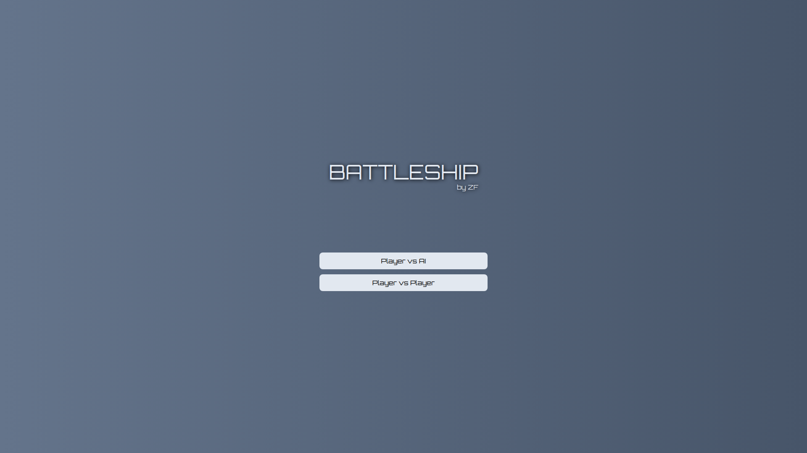
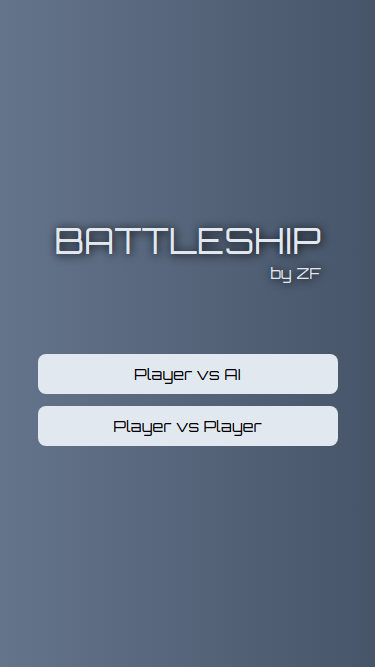
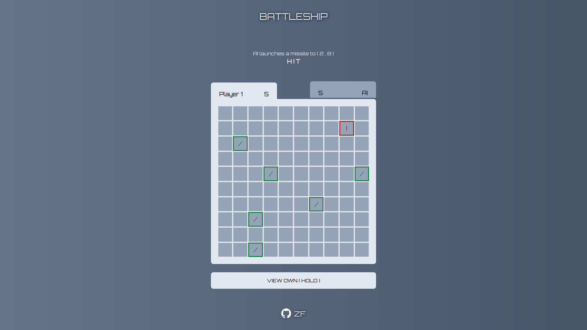
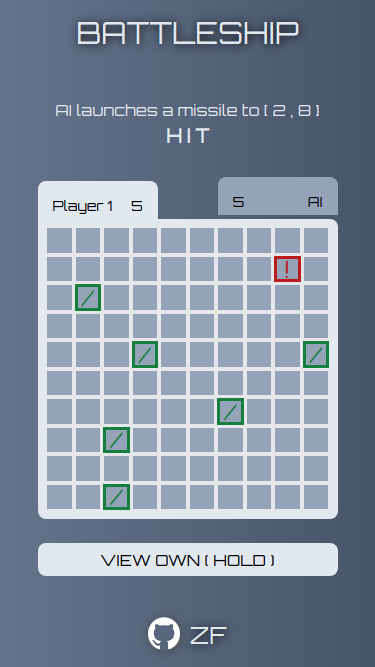

# Battleship
### The Odin Project: JavaScript Course
### [Project: Battleship](https://www.theodinproject.com/lessons/node-path-javascript-battleship)
### [Live Demo](https://woonzf.github.io/odin-battleship/)

- A two-player battleship game on a 10x10 squares board
- Two modes are available:
    - Player vs AI
    - Player vs Player (Local)
- It follows Hasbro's 2022 update, each player has 5 battleships:

    Class of ship | Size 
    ------------- | ----
    Carrier | 5
    Battleship | 4
    Destroyer | 3
    Submarine | 3
    Patrol Boat | 2

### Screenshots
Welcome screen:

 

Main screen:

 

### Languages used:
- HTML
- CSS
- JavaScript

### Frameworks used:
- Jest
- Tailwind CSS
- Prettier

### Module bundler used:
- Webpack

### Resources:
- [Orbitron font](https://fonts.google.com/specimen/Orbitron)
- [GitHub logo](https://github.com/logos)
- [Loading icon](https://pictogrammers.com/library/mdi/icon/loading/)

### Possible Improvements:
- Better AI that makes it recognize if the previous square is a hit and goes for adjacent squares
- Allow players to drag and drop ships during the formation phase
- Better layout with extra info section that provides more information to the players so that they can make better plays based on the size of each enemy battleship left, for example:

    Enemy Battleships | Quantity
    -- | --
    Carrier | 1
    Battleship | 0
    Destroyer | 1
    Submarine | 1
    Patrol Boat | 1